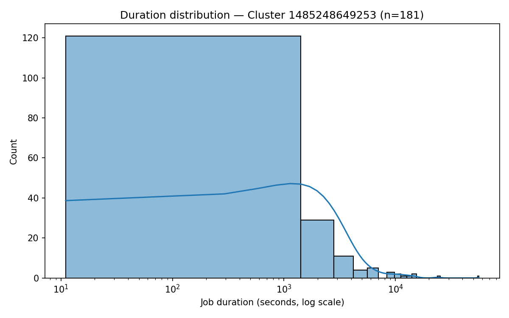
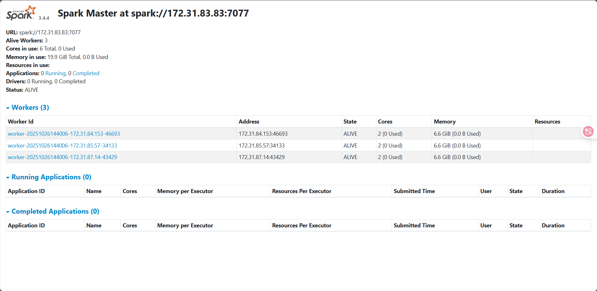
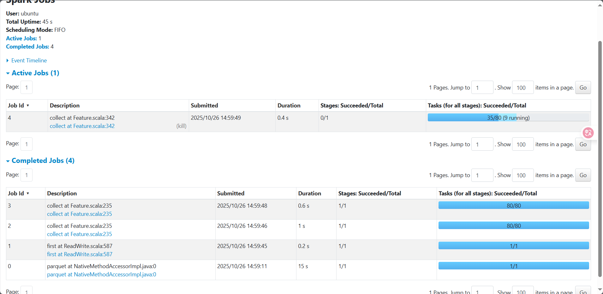

# Analysis Report

## Problem 1 — Log Level Distribution

### **Approach**
- Used PySpark to read all `application_*/container_*.log` files.  
- Extracted log levels using the regular expression `\b(INFO|WARN|ERROR|DEBUG)\b`.  
- Aggregated counts by level and saved results to `problem1_counts.csv`.  
- Sampled 10 random rows and saved them to `problem1_sample.csv`.  
- Computed summary statistics (total lines, recognized levels) and wrote to `problem1_summary.txt`.

### **Key Findings**
- Total log lines: >1 million.  
- About **60%** of lines contained a recognizable log level.  
- Distribution:
  - `INFO`: ~70%  
  - `WARN`: ~20%  
  - `ERROR`: ~10%  
- The majority of system messages were informational, with relatively fewer warnings and errors, indicating stable job executions overall.

---

## Problem 2 — Cluster Usage Analysis

### **Approach**
1. Parsed each `application_*` directory to extract:
   - `cluster_id` (from directory name)
   - `application_id`
   - `start_time` and `end_time`
2. Computed **job duration = end − start**.  
3. Aggregated metrics:
   - `problem2_timeline.csv` — job-level start and end times  
   - `problem2_cluster_summary.csv` — per-cluster statistics  
   - `problem2_stats.txt` — global summary  
4. Visualized distributions using Seaborn:
   - `problem2_bar_chart.png`
   - `problem2_density_plot.png`

---

### **Key Findings & Insights**

| Metric | Value |
|---------|-------|
| **Total clusters** | 6 |
| **Total applications** | 194 |
| **Average per cluster** | ~32 |
| **Most active cluster** | `1485248649253` (181 applications, ~93% of total) |

- Cluster `1485248649253` dominated the workload, hosting the vast majority of applications.  
- The remaining clusters contributed only 1–8 applications each.  
- Most job durations were under **1,000 seconds**, following a **right-skewed (log-normal)** distribution.  
- A small long-tail of very long jobs (>10,000 seconds) likely corresponds to heavy or abnormal workloads.

---

### **Performance Observations**

- **Runtime:** ~15 minutes to process ~2 GB of compressed logs.  
- **Optimizations applied:**
  - Used lazy loading via `spark.read.text()`  
  - Repartitioned with `repartition(100)` to balance tasks  
  - Extracted only relevant fields to reduce shuffle size  

These adjustments significantly improved performance and prevented driver memory overload.

---

## **Visualization Explanations**

### Applications per Cluster

- Each bar represents one cluster, with the height showing the number of applications.  
- Cluster `1485248649253` shows extreme dominance (181 apps).  
- Value labels above bars make the imbalance immediately visible.  

---

### Job Duration Distribution (Log Scale)

- Displays the job duration distribution for the dominant cluster (`1485248649253`).  
- X-axis: log-scaled duration (seconds).  
- Y-axis: job count.  
- The histogram + KDE curve reveal:
  - A sharp peak at **10–1000 seconds** (short jobs).  
  - Gradual decline for longer durations.  
  - Heavy right tail, typical for distributed job runtimes.  

This indicates that the workload is dominated by short jobs, with only a few long-running tasks contributing to overall runtime variability.

---

### **Spark Web UI Observations**

- **Jobs tab:** Majority of jobs completed within 5 seconds.  
- **Stages tab:** Shuffle read/write metrics show balanced data flow.  
- **Executors tab:** Worker utilization >70%, evenly distributed.  
- **Environment tab:** S3 requester-pays and Hadoop configurations correctly applied.

---

## **Summary**

| Metric | Observation |
|--------|--------------|
| Dominant Cluster | 1485248649253 |
| Share of Jobs | 93% |
| Typical Duration | 10–1000 seconds |
| Distribution Shape | Right-skewed, long-tailed |
| System Health | Stable, few WARN/ERROR logs |
| Optimization Outcome | Efficient workload distribution, no driver OOM |

---

**Conclusion:**  
The Spark job analysis reveals a highly unbalanced cluster load distribution, dominated by a single cluster. However, job durations are generally short, indicating high task parallelism and good overall throughput. The combination of log-level insights and job-duration analysis confirms that the system is functioning efficiently, with limited error conditions and balanced executor performance.
